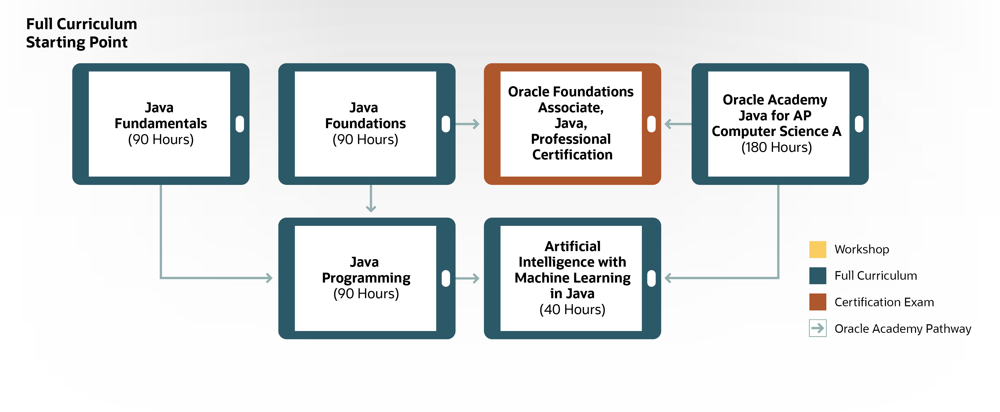
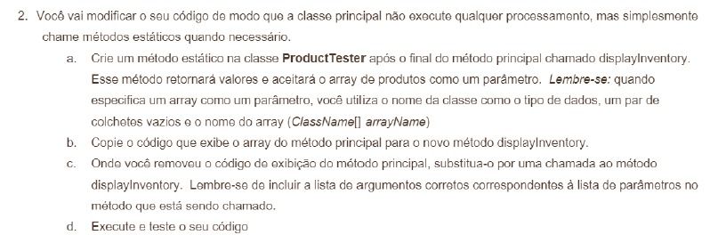

# Inventário com Java

Trabalho de conclusão do curso *JAVA Fundamentals* oferecido pela **ORACLE**.

## OBJETIVO DO PROJETO

O objetivo era aplicar os conhecimentos adquiridos durante o curso através do desenvolvimento de um sistema de Inventário através do terminal da IDE. Este foi o meu primeiro contato com a linguagem JAVA, e foi uma experiência incrível concluir o projeto. 

O *JAVA Fundamentals* é o primeiro de uma lista de cursos oferecidos pela **ORACLE**.

## REQUISITOS DO PROJETO

Como este é o curso introdutório de uma série de outros cursos sobre a linguagem, tudo foi apresentado de forma a orientar o aluno, portanto, as tarefas eram passadas de forma bem objetiva e instrutiva, para que que seja possível para o aluno desenvolver seguindo as boas práticas.

